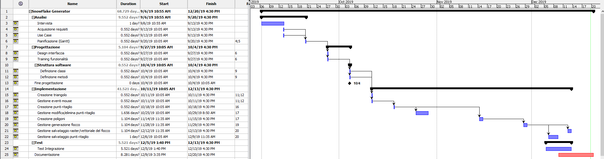
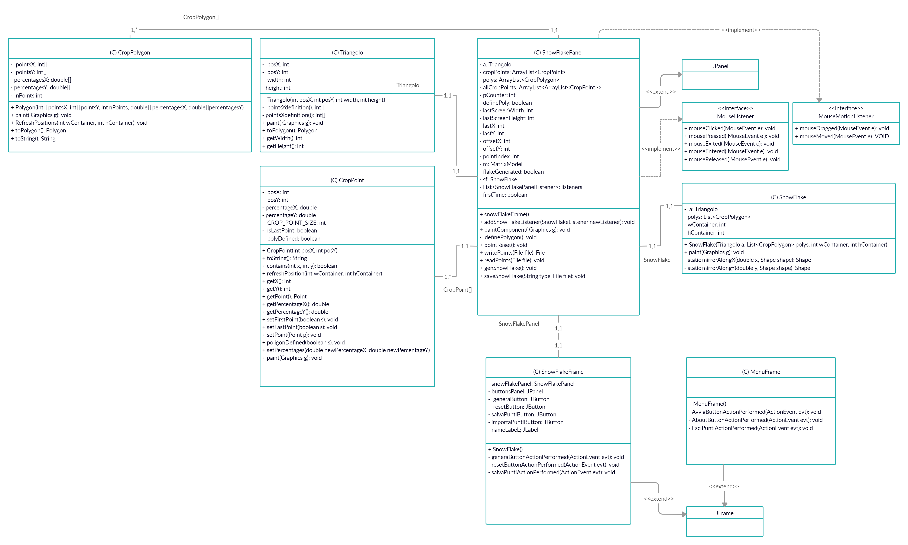
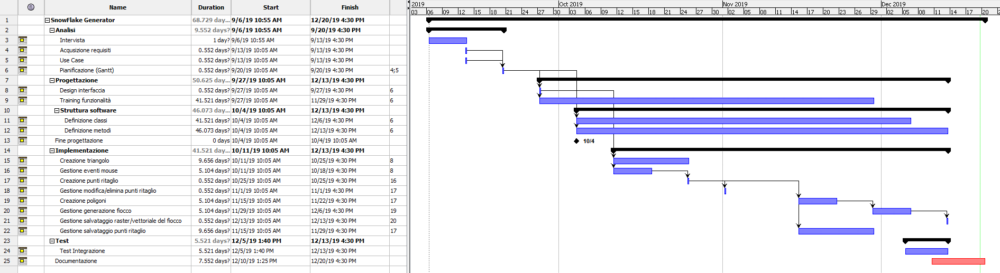

1. [Introduzione](#introduzione)

  - [Informazioni sul progetto](#informazioni-sul-progetto)

  - [Abstract](#abstract)

  - [Scopo](#scopo)

1. [Analisi](#analisi)

  - [Analisi del dominio](#analisi-del-dominio)
  
  - [Analisi dei mezzi](#analisi-dei-mezzi)

  - [Analisi e specifica dei requisiti](#analisi-e-specifica-dei-requisiti)

  - [Use case](#use-case)

  - [Pianificazione](#pianificazione)

1. [Progettazione](#progettazione)

  - [Design dell’architettura del sistema](#design-dell’architettura-del-sistema)

  - [Design dei dati e database](#design-dei-dati-e-database)

1. [Implementazione](#implementazione)

1. [Test](#test)

  - [Protocollo di test](#protocollo-di-test)

  - [Risultati test](#risultati-test)

  - [Mancanze/limitazioni conosciute](#mancanze/limitazioni-conosciute)

1. [Consuntivo](#consuntivo)

1. [Conclusioni](#conclusioni)

  - [Sviluppi futuri](#sviluppi-futuri)

  - [Considerazioni personali](#considerazioni-personali)

1. [Sitografia](#sitografia)

1. [Allegati](#allegati)


## Introduzione

### Informazioni sul progetto

Il progetto SnowFlake Generator comprende la partecipazione di: 

- André Da Silva, progettista e sviluppatore.
- Luca Muggiasca, docente,consulente e cliente.
- Geo Petrini, docente, consulente e cliente.

Data inizio: 06.09.19
Data fine: 20.12.19


SAMT, Sezione informatica modulo 306 + progetti.


### Abstract

Finding a software that allows you to create a snowflake starting from a clipped right triangle is very hard to find maybe even
impossibile, so this software made in Java resolve the problem. When the software is open, you can cut the triangle by placing some points over it in order to create some cuts polygon. After you created the cuts you wanted, you can finally generate the snow flake     and then, if you want, saving it in raster/vectorformat or resetting it and making a new one. If you're more interested on how  this   project was made, proceed with the reading of this document, or if you just want to test it, download it from the page link in the     readme file.
  
  

### Scopo

  Lo scopo del progetto è quello di sviluppare un software programmato in Java il cui compito è quello di
  generare un fiocco di neve. Per fare ciò l'utente deve ritagliare, a scelta, le varie parti di un triangolo 
  rettangolo al fine di generare il fiocco. Infine, per scelta dell'utente, sarà possibile salvare il risultato
  in formato raster o vettoriale.
  
  
## Analisi

### Analisi del dominio

  Essendo al terzo anno della sezione informatica della scuola Arti e Mestieri di Trevano, occorre
  essere capaci di progettare e sviluppare un progetto in modo autonomo, sia per l'esame del prossimo anno che in futuro in un'azienda. 
  Per questo, nel primo semestre, è stato deciso di affidarci a tutti lo stesso progetto, cioè un generatore di fiocchi
  di neve, di cui dobbiamo occuparci della progettazione con tutte le varie fasi (analisi,progettazione,implementazione,test).
  
### Analisi e specifica dei requisiti


  |**ID**	|**Nome**			|**Priorità**|**Vers**|**Note**  |
  |----|------------|--------|----|------|
  |Req-1 |Il software deve essere scritto in JAVA|1|1.0|-|
  |Req-2|Occorre l'utilizzo di un'interfaccia grafica|1|1.0|-|
  |Req-3|La finistra dell'interfaccia è ridimensionabile, minimo 1024x768|1|1.0|-|
  |Req-4|Deve esistere un sito con la descrizione del software|1|1.0|-|
  |Req-5|Deve essere possibile scaricare il software dal sito|1|1.0|-|
  |Req-6|Il software deve avere un'interfaccia grafica (jframe o frame)|1|1.0|-|
  |Req-7|All'avvio deve essere mostrato il triangolo da ritagliare|1|1.0|-|
  |Req-8|Il triangolo può ridimensionarsi in base alla grandezza dell'interfaccia (iniziale 50%)|1|1.0|-|
  |Req-9|I tagli (punti) del triangolo devono poter essere fatti con il mouse|1|1.0|-|
  |Req-10|Deve essere possibile resettare i punti del ritaglio|1|1.0|-|
  |Req-11|Deve esistere un tasto 'genera fiocco'|1|1.0|-|
  |Req-12|La generazione del fiocco deve avvenire in tempo reale (anteprima con i punti attualmente messi)|2|1.0|-|
  |Req-13|I punti devono poter essere spostati o rimossi |2|1.0|-|
  |Req-14|Il lavoro deve poter essere salvato|1|1.0|-|
  |Req-15|Il salvataggio del fiocco deve essere fatto in formato PNG o SVG tramite un bottone 'salva'|1|1.0|-|
  |Req-16|Il salvataggio deve avere dimensioni definite dall'utente|1|1.0|-|
  |Req-17|I punti devono essere salvabili in un file|1|1.0|-|
  |Req-18|I punti potranno essere importati tramite esplora file|1|1.0|-|
  |Req-19|È possibile switchare tra creazione/eliminazione punto tramite un bottone 'creazione/eliminazione'|2|1.0|-|
  
**Spiegazione elementi tabella dei requisiti:**

**ID**: ID dell' requisito

**Nome**: Breve descrizione del requisito

**Priorità**: indica l’importanza di un requisito nell’insieme del
progetto, definita assieme al committente:
1: Priorità alta
2: Priorità bassa

**Versione**: indica la versione del requisito. Ogni modifica del
requisito avrà una versione aggiornata.

**Note**: eventuali osservazioni importanti o riferimenti ad altri
requisiti.

### Use case


### Pianificazione




### Analisi dei mezzi

#### Hardware
- ASUS ROG GL702VM
#### Librerie
- Java Swing
- Java AWT
- Java IO
- ImageTracer

#### Piattaforma
Qualsiasi Sistema operativo (Windows,Mac OS, distribuzioni Linux, etc.)

## Progettazione

### Design dell’architettura del sistema

Sono stati stabiliti i seguenti componenti che, sicuramente, verranno implementati:

- **Tasto genera**: Bottone/tasto che se premuto, permetterà all'utente di generare il fiocco di neve.
- **Tasto switch crea/elimina punto**: Bottone/tasto che quando premuto, permetterà all'utente di cambiare modalità tra creare o eliminare i punti.
- **tasto salva punti**: Bottone/tasto che se premuto, permetterà il salvataggio dei punti creati per il ritaglio dentro ad un file con l'opzione per scegliere in che posto salvare.
- **tasto importa punti**: Bottone/tasto che se premuto, permetterà di importare dei punti precedentemente creati.
- **Tasto salva fiocco**: Bottone/tasto che una volta premuto, permetterà all'utente di salvare il fiocco di neve, scegliendo se in frmato PNG (raster) o SVG (vettoriale)
Tutti i seguenti bottoni verranno implementati tramite l'utlizzo della classe JButton.

- **Triangolo**: Triangolo che verrà ritagliato tramite dei punti ritaglio al fine di generare il fiocco di neve.
- **Punti ritaglio**: I punti che permetteranno all'utente di ritagliare il triangolo.
- **Fiocco di neve**: Il fiocco di neve generato dai ritagli del triangolo.
I 3 componenti sopra citati verranno invece, con molta probabilità, implementati con il componente grafico Graphics o Graphics2D e poi disegnati tramite i metodi paint/paintComponent.


### Design delle interfacce

L'interfaccia del software sarà composta da 2 frame:

- **Menu Frame**: Schermata iniziale con tasto "avvia" per utilizzare il SW, tasto "about" per delle informazioni sul software ed il tasto "esci" per poter chiudere il tutto.
- **SnowFlake Frame**: Frame principale del SW, composto da vari Panel, ognuno con il proprio scopo:
   - **SnowFlake Panel**: Pannello dove viene generato il triangolo, i tagli ed il fiocco di neve.
   - **Buttons Panel**: Pannello con i vari bottoni per il salvataggio, generazione fiocco, etc.
   - **Options Panel**: Pannello che includerà varie opzoni facoltative (es. colore sfondo), inoltre include il **PreviewPanel** che mostrerà l'anteprima del fiocco di neve.


### Design procedurale



## Implementazione

In questo capitolo viene spiegato, passo per passo, come sono strutturate tutte le classi che compongono il software.

**Triangolo**

Per generare il triangolo è stata creata una classe a parte di nome 'Triangolo' che richiede, per essere istanziata, le coordinate x e y del punto in cui disegnare il triangolo, ed infine larghezza e altezza. Per disegnare il triangolo si prendono le coordinate degli spigoli che vengono salvate in due array, uno per le X ed uno per le Y, definiti tramite 2 metodi:

```java

private int[] pointsXdefinition(){
       
        this.pointX[0] = this.posX;
        this.pointX[1] = this.posX + this.width;
        this.pointX[2] = this.posX + this.width;
        return pointX;
    
    }
    
    private int[] pointsYdefinition(){
        
        this.pointY[0] = this.posY;
        this.pointY[1] = this.posY;
        this.pointY[2] = this.posY + this.height;  
        return pointY;
    }

```
Infine per disegnare il Triangolo, si utilizza il metodo paint della liberia AWT:

```java

public void paint(Graphics g){
        
        //Creazione dei 2 array con le coordinate:
        int[] pointsX = pointsXdefinition();
        int[] pointsY = pointsYdefinition();
        
        g.setColor(this.color);
        //disegno
        g.fillPolygon(pointsX, pointsY,3);
        
}
```
Tra gli altri metodi importanti è presente anche **ToPolygon**, che converte il Triangolo in un poligono, utile poi per la creazione del fiocco.

**Matrix Model**

Affinchè il Triangolo venga centrato e sia sempre proprozionale al pannello, è stato necessario utilizzare una classe, già creata l'anno scorso per il modulo 226A, cioè **MatrixModel**. Questa riceve il numero di righe e colonne della matrice, margine, cioè la distanza dai bordi del contenitore, altezza e larghezza del contenitore e il ratio, cioè la differenza di proprozione tra la larghezza e la lunghezza di una cella. Al fine di calcolare il tutto, questa classe si avvale dei seguenti 2 metodi:


```java
/**
 * Ritorna un array contenente la larghezza e l'altezza di una cella della matrice (0 = larghezza, 1 = altezza). 
 * @return cs array contenente larghezza e altezza.
 */
public double[] getCellSize(){
		
	double[] cs = new double[2];
            
        if (this.wContainer / this.hContainer  > (this.cols * this.ratioX) / (this.rows * this.ratioY)) {
                    
        	cs[1] = this.hContainer / this.rows;
                cs[0] = cs[1] * this.ratioX / this.ratioY;
                      
        }else{
                
                cs[0] = this.wContainer / this.rows;
                cs[1] = cs[0] * this.ratioY / this.ratioX;
                
        }
            return cs;
}

/**
 * Ritorna un array contenente le coordinate X e Y affinche la matrice
 * sia centrata (0 = x, 1 = y). 
 * @return dxy array contenente le coordinate X e Y per il centramento.
*/
public double[] getDXYSize(){
		
	double[] dxy = new double[2]; //0 = x, 1 = y
		
        if (this.wContainer / this.hContainer  > (this.cols * this.ratioX) / (this.rows * this.ratioY)) {
                    
        	dxy[1] = this.margin;
                int width = (int)this.getCellSize()[0] * this.cols;
                dxy[0] = (this.wContainer - width) / 2;
                    
        }else{
                
                dxy[0] = this.margin;
                int height = (int)this.getCellSize()[1] * this.rows;
                dxy[1] = (this.hContainer - height) / 2;
                    
         }                
	 return dxy;
}
```
Dato che in questo caso quello che si vuole ridimensionare non è una matrice ma un triangolo, è stata instanziata nel seguente modo nel metodo paint del panel SnowFlakePanel:
```java
 this.m = new MatrixModel(1,1,25,this.getHeight(),this.getWidth(),1,1.73);
```
Come numero di righe e colonne viene inviato 1, come margine 25 e proporzioni 1:1.73 in quanto in un triangolo 30 60 90 (necessario al fine di creare un fiocco di neve, che non è altro che un esagono) l'altezza vale radice di 3 (=1.73) rispetto alla base.

E alla fine il triangolo viene istanziato usando i metodi della classe:
```java
this.a = new Triangolo((int)m.getDXYSize()[0],(int)m.getDXYSize()[1],(int)m.getCellSize()[0],(int)m.getCellSize()[1]);
this.a.paint(g);
```

**CropPoints**

Per rappresentare i punti creati è stata creata la classe CropPoints. Non è stata utilizzata la già presente classe Point della libreria AWT in quanto, al fine di rendere i punti 'Responsive', cioè che mantengono la loro posizione in caso di ingradimento o rimpicciolimento del frame, vengono passati alla creazione, oltre alle coordinate in cui bisogna disegnare il punto, anche la percentuale X e Y calcolate moltiplicando per 100 le coordinate X e Y e dividendole rispettivamente per la larghezza e l'altezza del SnowFlakePanel:
```java
 double percentageX = (e.getX()*100)/this.getWidth();
 double percentageY = (e.getY()*100)/this.getHeight();
 CropPoint point = new CropPoint(e.getX(),e.getY(),percentageX,percentageY);
```
Al fine di riaggiornare quindi le posizioni dei punti in base al cambiamento di dimensioni del Frame, è stato creato il metodo refreshPosition che calcola la nuova posizione utilizzando le percentuali salvate:
```java
public void refreshPosition(int wContainer, int hContainer){
 	
	double posXd = ((double)this.percentageX/100)*wContainer;
        double posYd = ((double)this.percentageY/100)*hContainer;
        this.posX = (int)posXd;
        this.posY = (int)posYd;
}
```
Inoltre anche il painting dei punti viene definito qui, sempre tramite paint di AWT, dove la grandezza di un punto è rappresentato dalla costante CROP_POINT_SIZE (default 10) e dove in base allo "stato" del punto, il colore cambia: 
- Ciano: Primo punto creato.
- Verde: Ultimo punto creato.
- Arancione: Significa che i punti ritaglio vengono chiusi.
- Rosso: Punto "Normale" (non è ne ultimo ne primo, ne viene definita la chiusura dei punti)


Per il cambio di stato, esistono i metodi setFirstPoint, setLastPoint e poligonDefined.
Infine, oltre a setter e getter vari, è presente anche il metodo contains(x,y) che permette di verificare se il punto passato tramite parametri è contenuto nel punto. Ciò viene utilizzato per verificare la chiusura dei puntie per l'eliminazione e il dragging di essi.
```java 
public boolean contains(int x, int y){
        
        Point p = new Point(x,y);
        Point center = new Point(this.posX+CROP_POINT_SIZE/2,this.posY+CROP_POINT_SIZE/2);  
        return center.distance(p) <= CROP_POINT_SIZE/2;
 }
```

**CropPolygon**

Per rappresentare invece i poligoni di ritaglio generati tramite i CropPoints, è stato deciso di creare la classe CropPolygon. Come per i CropPoints, anche in questo caso era possibile utilizzare la classe Polygon di AWT, ma come per i CropPoints era necessario che anche i poligoni fossero responsive. Per l'instanziazzione di un oggetto di questa classe, è necessario, in modo simile a Polygon, passare 2 array con le coordinate X e Y dei punti, 2 array con le percentuali delle coordinate X e Y dei punti ed infine il numero di punti da creare.
Anche questa classe possiede il metodo RefreshPositions, ma in questo caso, vengono passati ogni valore dei 2 array X e Y e aggiornati nello stesso modo dei CropPoints:

```java
 public void RefreshPositions(int wContainer, int hContainer){
    
        for(int i = 0; i < this.pointsX.length; i++){
            
              double posXd = ((double)this.percentagesX[i]/100)*wContainer;
              this.pointsX[i] = (int)posXd;
        }
        for(int i = 0; i < this.pointsY.length; i++){
            
            double posYd = ((double)this.percentagesY[i]/100)*hContainer;
            this.pointsY[i] = (int)posYd;
        }
    }
```
Sono presenti anche i metodi ToPolygon(), che come per il triangolo, permette la conversione in Poligono, e toString(), che ritorna invece una stringa contenente le percentuali X e Y al fine di poter salvare i punti in un file.

Di seguito uno screen di esempio di un poligono, tratto dai punti visti nelle 2 immagini precedenti:


**SnowFlakePanel**

SnowFlakePanel è a tutti gli effetti il Panel piu importante in quanto in esso avviene la creazione del Triangolo, l'aggiunta dei punti e la creazione dei poligoni di ritaglio ed infine il painting del fiocco di neve. SnowFlakePanel, oltre a estendere, ovviamente, la classe JPanel, implementa anche il MouseListener e MouseMotionListener, oltre ad un numero abbastanza alto di attributi, di cui i piu importanti sono:

- Triangolo a : L'oggetto di tipo triangolo che verrà poi definito con l'ausilio del Matrix Model per le coordinate e misure e disegnato 		 nel metodo paintComponent del pannello.
- MatrixModel m: Oggetto necessario al fine di, come detto nella descrizione della suddetta classe e in precedenza, calcolare le misure 		 e le coordinate necessarie affinché il Triangolo sia sempre proprozionale al pannello.

- ArrayList<CropPoint> cropPoints: ArrayList conetenente tutti i punti attualmente creati per la creazione di un poligono di ritaglio, 				   	   dopo che quest'ultimo viene generato, la lista si resetta al fine di poter crearne un'altro. 

- ArrayList<CropPolygon> polys: ArrayList che contiene tutti poligoni ritaglio definiti dall'utente. Fondamentale al fine di
				       creare l'area del Triangolo ritagliato, che poi viene utilizzato per generare il fiocco.
	
- Boolean definePoly: Booleano fodamentale al fine di capire, nel metodo MouseClicked del MouseListener implementato, se l'utente sta 			      definenendo i punti ritaglio, o sta modificando i punti già chiusi (colore arancione) che aspettano di poter 			      generare il poligono di ritaglio.

- Boolean SnowFlakeGenerated: Altro booleano fondamentale che permette di capire se il fiocco è stato generato e che quindi deve 				      impedire la creazione ed il painting di punti e poligoni.

I restanti attributi possono essere consultati nel codice con relativo commento javadoc o verranno descritti nei metodi fondamentali di questo JPanel, riportati qui di seguito:

**Creazione/eliminazione punti**

Il metodo astratto MouseClicked del MouseListener si occupa di creare ed eliminare i punti rispettivamente tramite i tasti sinistro e destro del mouse. Oltre a ciò, avvengono anche il calcolo delle percentuali dei punti,i loro cambiamenti in base alla creazione o rimozione di essi e verifica, tramite l'attributo definePoly, se l'utente può aggiungere altri punti o essi sono stati chiusi al fine di poter definire il poligono e pulire la lista cropPoints. è presente anche l'attributo pCounter che verifica se il numero di punti creati soddisfi la creazione di 1 poligono (minimo 3 quindi). Per la rimozione dei punti viene verificato, oltre al click del tasto destro, se il cursore è contenuto dentro ad un punto tramite il suo metodo contains ed esegue anche gli eventuali cambi di colore che i punti possono effettuare.
Di seguito, in dettaglio, il codice del metodo:

```java
 //aggiunta punti tramite tasto SX
        if(e.getButton() == MouseEvent.BUTTON1){
            
            //verifica se l'utente può aggiungere/rimuovere punti di ritaglio.
            if(this.definePoly){
                
               
                double percentageX = (e.getX()*100)/this.getWidth();
                double percentageY = (e.getY()*100)/this.getHeight();
                CropPoint point = new CropPoint(e.getX(),e.getY(),percentageX,percentageY);
                
                //verifica se il numero minimo di punti è 3 al fine di creare un poligono, e verifica
		//anche se l'ultimo punto che si vuole creare è contenuto nel primo al fine di chiudere il tutto.
                if(this.pCounter >= 3){
                    if(cropPoints.get(0).contains(e.getX(),e.getY())){
                        this.definePoly = false;   
                    }
                }
                
                //verifica se è possibile aggiungere il punto tramite definePoly.
                if(this.definePoly){
                    this.cropPoints.add(point);
                }
                
                //se il numero di punti creati è 0, setta il colore ciano per questo punto tramite setFirstPoint.
                if(this.pCounter == 0){
                    this.cropPoints.get(0).setFirstPoint(true);
                }
                
                //setta questo punto come ultimo, impostando il colore verde tramite setLastPoint(true) e setta tutti gli altri
                //punti creati false al fine di renderli rossi o ciano per il primo punto.
                cropPoints.get(cropPoints.size()-1).setLastPoint(true);
                for(int i = 0; i<cropPoints.size()-1; i++) {
                        this.cropPoints.get(i).setLastPoint(false);
                }
                
                //se la definizione dei punti del poligono è finita, colora di arancione tutti i punti.
                if(this.definePoly == false){
                    for(int i = 0; i<cropPoints.size(); i++) {
                        this.cropPoints.get(i).poligonDefined(true);
                    }
                }   
                this.pCounter++;
            }else if(this.definePoly == false){
                
                //definizione del poligono.
                this.defineCropPolygon();
                this.cropPoints.clear();
            }
        }
        
        //rimozione punti tramite tasto DX
        if(e.getButton() == MouseEvent.BUTTON3){
           
            //Verifica se l'utente può aggiungere/rimuovere punti.
            if(this.definePoly){
                
                //verifica se il cursore si trova sopra ad almeno 1 punto.
                for(int i = 0; i<cropPoints.size()-1; i++) {
                    if(this.cropPoints.get(i).contains(e.getX(),e.getY())){                    
                        this.cropPoints.remove(this.cropPoints.get(i));
                        this.cropPoints.get(this.cropPoints.size()-1).setLastPoint(true);
                        this.cropPoints.get(0).setFirstPoint(true);
                    }
                }
            }
        }
        repaint();
```

**Dragging dei punti**

Per il dragging dei punti è stata usata una tecnica semplice e intuitiva usata in molti applicativi grafici in Java e non. 
Essa consiste nel prendere le coordinate del mouse alla pressione del tasto sinistro, verificabile tramite il metodo MousePressed del MouseListener, e le immagazzina negli attributi lastX e lastY, infine verifica se esse sono contenute all'interno di un punto ritaglio già creato. Se questa condizione si avvera, imposta l'attributo drag a true cioè che può avvenire un possibile drag del mouse e calcola gli offset tra le coordinate lastX e lastY e quelle del punto selezionato, infine si salva anche l'id della lista del punto selezionato tramite l'attributo pointIndex.
Nel metodo astratto MouseDragged del MouseMotionListener viene verificato se il boolean drag è stato a true, cioè significa che sta avvenendo un trascinamento del mouse e calcola la nuova posizione del punto che si sta spostando tramite le coordinate attuali del mouse e quelle del offset. Vengono infine calcolate anche le percentuali X e Y nuove che il punto occupa su schermo e viene effettuato setting delle nuove percentuali e coordinate.
Nel metodo MouseReleased, sempre del MouseMotionListener, viene inoltre impostata a false il boolean drag in quanto indica che  il trascinamento del mouse è concluso.

Codice:

```java

    @Override
    public void mousePressed(MouseEvent e) {
        
        this.lastX = e.getX();
        this.lastY = e.getY();
        
        for(int i = 0; i<cropPoints.size(); i++) {
            if(cropPoints.get(i).contains(this.lastX,this.lastY)){
                
                this.drag = true;
                this.offsetX = this.lastX - this.cropPoints.get(i).getX();
                this.offsetY = this.lastY - this.cropPoints.get(i).getY();
                this.pointIndex = i;
            }
        }     
    }
    
    @Override
    public void mouseDragged(MouseEvent e) {
                  
        if(this.drag){
            int x = e.getX() - this.offsetX;
            int y = e.getY() - this.offsetY;
            double percentageX = (x*100)/this.getWidth();
            double percentageY = (y*100)/this.getHeight();
            Point newCoords = new Point(x,y);
            this.cropPoints.get(this.pointIndex).setPoint(newCoords);
            this.cropPoints.get(this.pointIndex).setPercentages(percentageX, percentageY);
            repaint();    
        }             
    }
    
    @Override
    public void mouseReleased(MouseEvent arg0) {
        this.drag = false;
    }
```

**Creazione dei poligoni di ritaglio**

Per la definizione dei poligoni di ritaglio, viene utilizzato il metodo definePolygon() il quale viene chiamato 2 volte:

- Quando viene cliccato il tasto sinistro del mouse mentre la variabile definePoly si trova a false.
- Per l'import dei punti al fine di definire i poligoni importati (in questo caso viene definePoly viene forzato a diventare false prima).

Esso prima di tutto verifica, per sicurezza, se definePoly è false. Se questa condizione viene soddisfatta, crea 4 array:
- 2 per le X e Y presenti all'interno della lista di punti cropPoints.
- 2 per le Percentuali X e Y, sempre presenti all'interno della suddetta lista.

A questo punto viene creato un nuovo poligono con tutti questi dati e viene aggiunto all'interno della lista di poligoni polys.
E per concludere, definePoly viene risettato a true al fine di poter ricreare nuovi punti e resettato pCounter in quanto, ovviamente, non ci sono piu punti creati.

Codice:

```java
private void defineCropPolygon(){
    
        if(this.definePoly == false){
            
            int[] pointsX = new int[cropPoints.size()];
            int[] pointsY = new int[cropPoints.size()];
            double[] percentagesX = new double[cropPoints.size()];
            double[] percentagesY = new double[cropPoints.size()];
            
            for(int j = 0;j<cropPoints.size();j++) {
                  pointsX[j] = cropPoints.get(j).getX();
                  pointsY[j] = cropPoints.get(j).getY();
            }
            for(int j = 0;j<cropPoints.size();j++) {
                  percentagesX[j] = cropPoints.get(j).getPercentageX();
                  percentagesY[j] = cropPoints.get(j).getPercentageY();
            }
            
            CropPolygon p = new CropPolygon(pointsX,pointsY,this.cropPoints.size(),percentagesX,percentagesY);
            this.polys.add(p);
            this.definePoly = true;
            this.pCounter = 0;   
            
        }
    }
```
**Scrittura/lettura punti**

Per la scrittura dei punti, presente nel metodo writePoints(File file) sono stati utilizzati gli oggetti FileWriter e PrintWriter. Il primo permette la scrittura di caratteri nel file passato, mentre il secondo a poterli stampare in quest'ultimo (file). Quello che viene fatto semplicemente è stampare grazie a printWriter, tutte le percentuali dei poligoni della lista polys,con un ciclo for, tramite il metodo toString() della classe CropPolygon che è strutturato nel seguente formato:


Alla fine viene ritornato il file scritto.

Per la lettura dei punti invece, viene utilizzato il metodo readPoints il quale richiede sempre un file come argomento.
In questo caso, l'oggetto utilizzato è il BufferedReader il quale li viene passato il file tramite l'oggetto FileReader. Per leggere quindi ogni riga del file, occorre utilizzare il metodo readLine() del buffer finchè non viene raggiunta l'ultima riga, con l'utilizzo di un ciclo while. Dentro al while si naviga, per ogni riga, i caratteri che la compongono e si salvano in un array le percentuali  X finchè non viene trovato il carattare delimitatore '|', da qui in poi, i dati verranno salvati in un secondo array per le percentuali Y. Dopodiché, per ogni coordinata X e Y dei 2 array, viene creato un CropPoint che viene aggiunto alla lista CropPoints. Infine viene richiamato il metodo definePolygons per la definizioni dei poligoni.

Codice: 

```java

public void readPoints(File file) throws FileNotFoundException, IOException {
        
        BufferedReader in = new BufferedReader(new FileReader(file));    
        this.pointReset();
        String st;
        while ((st = in.readLine()) != null) {
            for(int i = 0; i < st.length()-1;i++){
                if(st.charAt(i) == '|'){   
                    String x = st.substring(0,i);
                    String y = st.substring(i+1,st.length()-1);
                    String[] splitX = x.split("-");
                    String[] splitY = y.split("-");
                    if(splitX.length == splitY.length){
                        for(int j = 0; j < splitX.length; j++){
                            CropPoint p = new CropPoint(0,0,(int)Double.parseDouble(splitX[j]),(int)Double.parseDouble(splitY[j]));
                            p.refreshPosition(this.getWidth(),this.getHeight());
                            this.cropPoints.add(p);
                        }
                        this.definePoly = false;
                        this.defineCropPolygon();
                        this.cropPoints.clear();
                    }else{
                        System.out.println("Impossibile!");
                    }
                }
            }
        }
        repaint();
    }
```

**Salvataggio del fiocco di neve**

Per poter salvare un fiocco di neve generato, il software utilizza il metodo saveSnowFlake dello SnowFlakePanel che chiede come parametri il tipo di salvataggio (png o svg) e il percorso in cui salvare il file.

Se viene scelto di salvare in png, viene utilizzata la classe BufferedImage che permette di definire un buffer in cui disegnare al suo interno passandogli altezza&larghezza del pannello e il tipo. Fatto ciò viene utilizzato il metodo paint per disegnare dentro al buffer ed infine scritto il contenuto di quest'ultimo nel file.

Se invece vine scelto di salvare in svg, viene sempre definito un BufferedImage, ma in questo caso si utilizza una classe esterna, presa da internet, di nome ImageTracer che tramite il suo metodo saveString e passandogli la path e la conversione in svg del buffer tramite il metodo imageToSVG sempre della classe ImageTracer, esegue la conversione da raster a SVG.

Codice:


```java
 public File saveSnowFlake(String type,String path) throws Exception {
    
        if(type.equals("png")){
            
            BufferedImage img = new BufferedImage(this.getWidth(),this.getHeight(), BufferedImage.TYPE_INT_RGB);
            this.paint(img.getGraphics());
            File out = new File(path);
            try {
                ImageIO.write(img,"png", out);   
            } catch (IOException ex) {
                Logger.getLogger(SnowFlakePanel.class.getName()).log(Level.SEVERE, null, ex);
            }
            return out;
            
        }else if(type.equals("svg")){
            
           BufferedImage img = new BufferedImage(this.getWidth(),this.getHeight(), BufferedImage.TYPE_INT_RGB);
           this.paint(img.getGraphics());
           ImageTracer.saveString(path,ImageTracer.imageToSVG(img,null,null));
           
           
        }
        return null;
    }
```

**Paint dei componenti**

Il paint di ogni singolo componente creato o presente già dall'inizio, viene fatto nel metodo PaintComponent del SnowFlakePanel. Qui è dove il matrix model viene instanziato, insieme al triangolo e poi disegnato, come visto in precedenza.
Per i componenti presenti nelle liste (polys e cropPoints) viene utilizzato un foreach, e per ognuno di essi viene richiamato il metodo RefreshPositions (al fine di riaggiornare in caso le dimensioni del frame cambino) e paint(g). Per i cropPoints viene anche disegnato il filo/linea che connette i vari punti quando la variabile locale i è maggiore di 0, ed utilizza quindi le coordinate del punto precedente e quello attuale per effettuare il drawLine:

```java
int i = 0;
for(CropPoint p : this.cropPoints){
	p.refreshPosition(this.getWidth(),this.getHeight());  
        p.paint(g);

        if(i >= 1){
        	g.setColor(Color.black);
                g.drawLine(this.cropPoints.get(i).getX(),this.cropPoints.get(i).getY(),this.cropPoints.get(i-1).getX(),this.cropPoints.get(i-1).getY());           
	}
	i++;
}
```
Inoltre qui viene anche invocato il metodo polygonCreated per ogni listener di SnowFlakeListener, che verrà trattato in seguito:

```java
  if(this.polys.size() > 0){
               
                for(SnowFlakePanelListener l : this.listeners){
                    l.polygonCreated(this.polys);
                }
            }
```
Tutto il painting precedentemente visto avviene però esclusivamente se la variabile snowFlakeGenerated è settata a true in quanto in caso contrario, viene generato e disegnato il fiocco di neve utilizzando l'istanziazione dell'attributo sf che si tratta di un oggetto di tipo SnowFlake. Inoltre viene eseguito per l'ultima volta un refresh di sicurezza di ogni coordinata dei vari punti dei CropPolygon presenti nella lista polys, garantito tramite l'attributo firstTime.

```java
}else if(this.flakeGenerated){
	if(this.firstTime){
                for(int i =0 ; i < this.polys.size();i++){
                    this.polys.get(i).RefreshPositions(this.getWidth(),this.getHeight());
                }
                this.firstTime = false;
         }
         this.sf = new SnowFlake(this.a,this.polys,this.getWidth(),this.getHeight());
         this.sf.paint(g);
}
```

**Preview del Fiocco di neve**

Anche se facoltativa, nel software è stata integrata una preview del fiocco di neve che si andrà a creare. Cioè, ogni volta che l'utente genererà un poligono di ritaglio, nel PreviewPanel, contenuto all'interno del MarginPanel, verrà disegnato un fiocco di neve con i ritagli corrispondenti ai poligoni attualmente creati.

Esempio: 


Affinchè avvenga tutto ciò viene utilizzato il listener **SnowFlakePanelListener** che possiede un metodo astratto di nome polygonChanged che richiede come parametro una lista di CropPolygons.
Nel SnowFlakePanel è presente una lista di questi SnowFlakeListener di nome listeners che viene aggiornata nel paint come visto in precedenza, richiamando il metodo polygonChanged con parametro polys quando la lista di poligoni è maggiore di 0.
Per passare quindi la lista di CropPolygons dallo SowFlakePanel al PreviewPanel, si utilizza il Frame principale, SnowFlakeFrame come "intermediario". In quest'ultimo viene implementato SnowFlakeListener e messo in ascolto nel costruttore del Frame:

```java

this.snowFlakePanel.addSnowFlakePanelListener(this);

```
A questo punto nel metodo astratto 'ereditato' dall listener, viene passato al PreviewPanel la lista di CropPolygons tramite il suo metodo setCropPolygon(<Lista>):

```java
@Override
public void polygonCreated(List<CropPolygon> cp) {
	this.previewPanel1.setCropPolygon(cp);
}
```

**PreviewPanel**

La classe PreviewPanel è un JPanel il quale compito è quello di generare un fiocco di neve temporaneo con i poligoni di ritaglio attualmente definiti dall'utente.
Per fare ciò utilizza i seguenti attributi:

- List<CropPolygon> cp: lista con gli attuali poligoni creati.
- Triangolo t: Triangolo su cui applicare i ritagli.
- MatrixModel m: Necessario al fine di ridimensionare il Triangolo.
- SnowFlake sf: Fiocco di neve che funge da preview utilizzando i poligoni.
- Boolean isFlakeGenerated: Serve a verificare se è stato generato il fiocco di neve definitivo e quindi smettere di disegnare
			    la preview (true), o continuare (false).
	
I metodi utilizzati dalla classe sono:

setCropPolygon(List<cropPolygon cp): fa un clear dell'attributo cp ed aggiunge gli elementi della lista passata come parametro.
snowFlakeCreated(boolean flag): imposta true/false l'attributo isSnowFlakeGenerated.
resetCropPolygon(): pulisca la lista cp.

Nel metodo paintComponent avvengono invece tutti i panting dei componenti, sempre però se la variabile isFlakeGenerated lo permetta:

```java
 public void paintComponent(Graphics g){
        super.paintComponent(g);
        
        if(!this.isFlakeGenerated){
            this.m = new MatrixModel(1,1,25,this.getHeight(),this.getWidth(),1,1.73);
            this.t = new Triangolo((int)m.getDXYSize()[0],(int)m.getDXYSize()[1],(int)m.getCellSize()[0],(int)m.getCellSize()[1]);
            this.t.setColor(Color.blue);
            this.t.paint(g);
            for(int i = 0; i < this.cp.size();i++){
                this.cp.get(i).RefreshPositions(this.getWidth(),this.getHeight());
            }
            if(this.cp.size() > 0){

               SnowFlake s = new SnowFlake(this.t,this.cp,this.getWidth(),this.getHeight());
                s.paint(g);
            }
        }  
    }
```
è da notare come anche il triangolo viene disegnato ma il suo colore viene settato a blu tramite il metodo setColor, al fine di non risultare visible. Questo perché, a quanto pare, il metodo Area di SnowFlake non può lavorare con elementi non disegnati. Viene anche verificato se la lista di poligoni sia maggiore di 0 al fine di poter generare un fiocco 'temporaneo'.

**SnowFlakeFrame** 

la classe SnowFlakeFrame è un JFrame il cui compito principale è quello di "riunire" tutti i vari pannelli creati e che devono comunicare tra di loro.

In esso viene creato direttamente il ButtonsPanel, un JPanel contenente i JButtons fondamentali, che sono:

- SalvaPuntiButton: Bottone il cui compito è, alla sua pressione, quello di poter salvare i file con i punti ritaglio attualmente 		      definiti dall'utente.
		    Per fare ciò, usufruisce della classe JFileChooser che permette di selezionare la directory in cui salvare il file 			   tramite il metodo getSelectedFile(), mentre per poter scriverci dentro il contenuto, si utilizza il 			   	    metodo writePoints(File file), già visto in precedenza, dello SnowFlakePanel:		    
```java

 private void SalvaPuntiButtonActionPerformed(java.awt.event.ActionEvent evt) {                                                 
       
        JFileChooser fileChooser = new JFileChooser();
        
        fileChooser.setDialogTitle("Specify a file to save");   

        int userSelection = fileChooser.showSaveDialog(this);
        
        if (userSelection == JFileChooser.APPROVE_OPTION) {
                         
            File fileToSave = fileChooser.getSelectedFile();  //File da salvare
            try {
                fileToSave = this.snowFlakePanel.writePoints(fileToSave);
            } catch (IOException ex) {
                Logger.getLogger(SnowFlakeFrame.class.getName()).log(Level.SEVERE, null, ex);
            }
            System.out.println("Save as file: " + fileToSave.getAbsolutePath());
                  
        }
    }   
```
- ImportaPuntiButton: Bottone che come dice da nome, alla sua pressione, permette all'utente di scegliere un file binario (es. .txt) da 		      importare contentente le percentuali dei punti ritaglio. La struttura del codice è la stessa del bottone per 			 salvare, ma utilizza il metodo readPoints(File file).
- salvaSVGButton: Bottone che si occupa di salvare, quando premuto, il fiocco di neve in formato SVG. Stessa struttura dei 2 bottoni 		       precedenti, ma utilizza il metodo saveSnowFlake("svg",FilePath).
- salvaPNGButton: Bottone che si occupa di salvare, quando premuto, il fiocco di neve in formato PNG. Stessa struttura dei 3 bottoni 		       precedenti, ma utilizza il metodo saveSnowFlake("png",FilePath). 

Entrambi i bottoni per il salvataggio sono disabilitati all'avvio e vengono abilitati una volta generato il fiocco.

- GeneraButton: Bottone che se premuto, genera il fiocco di neve richiamando i metodi genSnowFlake del SnowFlakePanel per settare 		  l'attributo FlakeGenerated a true, vengono abilitati i 2 tasti salva e viene settato a true l'attributo   				isSnowFlakeGenerated del previewPanel:
 
 ```java
 
 private void GeneraButtonActionPerformed(java.awt.event.ActionEvent evt) {                                             
       this.snowFlakePanel.genSnowFlake();
       this.salvaPNGButton.setEnabled(true);
       this.salvaSVGButton.setEnabled(true);
       this.previewPanel1.setVisible(false);
       this.previewPanel1.SnowFlakeCreated(true);
    }
 ```

- ResetButton: Bottone che se premuto esegue in sintesi le operazioni inverse del bottone genera:

```java
 private void ResetButtonActionPerformed(java.awt.event.ActionEvent evt) {                                            
        this.snowFlakePanel.pointReset();
        this.salvaPNGButton.setEnabled(false);
        this.salvaSVGButton.setEnabled(false);
        this.previewPanel1.resetCropPolygons();
        this.previewPanel1.SnowFlakeCreated(false);
        this.previewPanel1.setVisible(true);
        this.previewPanel1.repaint();
    } 
```

**MenuFrame**

Si tratta semplicemente del JFrame presente all'avvio con le 3 opzioni già viste nel design delle interfacce.

## Test

### Protocollo di test

|Test Case      | TC-001                               |
|---------------|--------------------------------------|
|**Nome**       |Generazione triangolo centrato proporzionalmente |
|**Riferimento**|REQ-07,REQ-08                               |
|**Descrizione**|Aprendo il SW, si crea un triangolo centrato e proporzionale al pannello |
|**Prerequisiti**| Aprire il SW |
|**Procedura**   | Aprire il SW tramite il file .jar o NetBeans |
|**Risultati attesi** | Il triangolo è presente centrato e ridimensionando il frame, si adatta ad esso |

|Test Case      | TC-002                               |
|---------------|--------------------------------------|
|**Nome**       |Creazione punti ritaglio |
|**Riferimento**|REQ-09                              |
|**Descrizione**|è possibile generare dei 'punti ritaglio' al fine di creare dei 'poligoni ritaglio'|
|**Prerequisiti**| Aprire il SW, mouse |
|**Procedura**   | Aprire il SW tramite il file .jar o NetBeans, Cliccare con il tasto Sx in un punto qualsiasi del frame |
|**Risultati attesi** | I punti ritaglio vengono creati e sono collegati tra di loro in caso non venga ancora definito il poligono |

|Test Case      | TC-003                               |
|---------------|--------------------------------------|
|**Nome**       |Eliminazione punti ritaglio |
|**Riferimento**|REQ-13                             |
|**Descrizione**|è possibile eliminare 'punti ritaglio' creati|
|**Prerequisiti**| Aver generarato almeno 1 punto |
|**Procedura**   | Dopo aver creato un punto ritaglio, premendoci sopra con il tasto destro dovrebbe eliminarsi. In caso si avesse già creato altri punti, essi continuano ad essere connessi tra di loro senza problemi |
|**Risultati attesi** | Il punto selezionato non c'è piu, la struttura di punti precedentemente creata continua ad esistere correttamente |

|Test Case      | TC-004                               |
|---------------|--------------------------------------|
|**Nome**       |Spostamento punti ritaglio |
|**Riferimento**|REQ-13                             |
|**Descrizione**|è possibile spostare i punti ritaglio selezionati |
|**Prerequisiti**| Aver generarato almeno 1 punto |
|**Procedura**   | Dopo aver creato un punto ritaglio, tener premuto il tasto sx su di esso e trascinarlo con il mouse. |
|**Risultati attesi** | Il punto selezionato si sposta seguendo correttamente il cursore. In caso di piu punti creati, anche il filo connesso ad esso si muove e segue il punto. |

|Test Case      | TC-005                               |
|---------------|--------------------------------------|
|**Nome**       |Generazione poligono di ritaglio |
|**Riferimento**|REQ-09                             |
|**Descrizione**|è possibile generare un poligono di ritaglio tramite chiusura dei punti ritaglio |
|**Prerequisiti**| Aver generarato 2 punti |
|**Procedura**   | Dopo aver creato 2 punti, il terzo dovrà essere fatto sopra il primo affinchè venga chiuso. A questo punto, il colore dei punti risulterà essere Arancione e premendo il tasto sx del mouse, si genera il poligono. |
|**Risultati attesi** | Viene generato un poligono blu dove prima vi erano i punti ritaglio. |

|Test Case      | TC-006                               |
|---------------|--------------------------------------|
|**Nome**       |Reset dei punti ritaglio |
|**Riferimento**|REQ-10                             |
|**Descrizione**|è possibile resettare i punti e i poligoni ritagli creati |
|**Prerequisiti**| Aver generato almeno 1 punto o 1 poligono ritaglio |
|**Procedura**   | Dopo aver fatto almeno 1 punto o poligono di ritaglio, premere il tasto 'reset', presente nel pannello dei bottoni |
|**Risultati attesi** | Tutti gli elementi creati (punti o poligoni) vengono eliminati. Se il tasto viene premuto dopo aver già generato il fiocco, quest'ultimo si eliminerà e si ritornerà alla modalità di ritaglio del triangolo. |

|Test Case      | TC-007                               |
|---------------|--------------------------------------|
|**Nome**       |Generazione fiocco |
|**Riferimento**|REQ-11                             |
|**Descrizione**|è possibile generare un fiocco di neve |
|**Prerequisiti**| Apertura SW |
|**Procedura**   | Premere il tasto 'genera' del pannello con tutti i pulsanti. Si consiglia di aver generato prima un poligono ritaglio sul triangolo per poter vedere il risultato dei ritagli. |
|**Risultati attesi** | Si genera il fiocco di neve (con o senza ritagli).  |

|Test Case      | TC-008                               |
|---------------|--------------------------------------|
|**Nome**       |Salvataggio dei punti ritaglio |
|**Riferimento**|REQ-14, REQ-17                        |
|**Descrizione**|è possibile salvare tutti i punti di ritaglio fatti sul triangolo |
|**Prerequisiti**| Aver generato almeno 1 poligono ritaglio |
|**Procedura**   | Creare un poligono di ritaglio, dopodiché, premere il tasto 'salva punti' e scegliere nome e dove salvare il file con i punti. (ogni formato binario è accettato) |
|**Risultati attesi** | Si viene a creare un file binario (es. .txt) con le coordinate dei punti creati. |

|Test Case      | TC-009                               |
|---------------|--------------------------------------|
|**Nome**       |Salvataggio fiocco di neve            |
|**Riferimento**|REQ-14, REQ-15, REQ-16                       |
|**Descrizione**|è possibile salvare il fiocco generato in formato png o svg. |
|**Prerequisiti**| Aver generato il fiocco di neve |
|**Procedura**   | Dopo aver generato il fiocco di neve, premere il tasto salva e scegliere se salvare in png o svg, dimensioni, nome e la directory. |
|**Risultati attesi** | Si viene a creare un file png o svg con il fiocco di neve disegnato. |

|Test Case      | TC-010                               |
|---------------|--------------------------------------|
|**Nome**       |Import dei punti ritaglio            |
|**Riferimento**|REQ-18                     |
|**Descrizione**|è possibile importare i punti ritaglio creati in precedenza. |
|**Prerequisiti**| Aver già creato e salvato dei punti ritaglio di uno o piu poligoni |
|**Procedura**   | Premere il tasto 'importa punti' e scegliere il file binario dei punti. |
|**Risultati attesi** | Si viene a creare il o i poligoni di ritaglio nella posizione dei punti importati. |

|Test Case      | TC-011                               |
|---------------|--------------------------------------|
|**Nome**       |Generazione in tempo reale del fiocco            |
|**Riferimento**|REQ-12                     |
|**Descrizione**|Ad ogni poligono generato, si crea un'anteprima del fiocco con i tagli fatti |
|**Prerequisiti**| Aprire il SW |
|**Procedura**   | Creare un poligono di ritaglio.  |
|**Risultati attesi** | Nel piccolo pannello a destra, si viene a generare un fiocco con i tagli fatti. |


### Risultati test

| Test Case | Stato | 
|-----------|-------|
|   TC-001  | Riuscito |            
|   TC-002  | Riuscito |            
|   TC-003  | Riuscito |           
|   TC-004  | Riuscito |
|   TC-005 | Riuscito |             
|   TC-006 | Riuscito |             
|   TC-007 | Riuscito |             
|   TC-008 | Riuscito |             
|   TC-009 | Riuscito |  
|   TC-010 | Riuscito |             
|   TC-011 | Riuscito |             


### Mancanze/limitazioni conosciute

- Non è presente nessun tasto per lo switch creazione/elimina, ma l'operazione viene eseguita con i tasti sinistro o destro del mouse.
- Non è possibile scegliere la dimensione con cui salvare l'immagine.
- La preview del fiocco di neve funziona, ma non rappresenta correttamente al 100% il fiocco di neve che verrà generato in seguito.

## Consuntivo



La progettazione e l'implementazione vengono eseguite in alcuni punti parallelamente, in quanto spesso l'idea di progettare deteriminate classi veniva dopo averne già implementate e progettate altre.

## Conclusioni

Mi ritengo abbastanza soddisfatto del esito del progetto, anche se probabilmente una gestione dei tempi maggiormente accurata e rispettata e una progettazione/strutturazione di come sarebbe stato scritto il codice migliore con anche l'utilizzo di determinate implementazioni, magari piu semplici e fattibili ma non trovate (in quanto non pensate) durante la creazione, avrebbero reso il software piu godibile da utilizzare, anche esteticamente.
Per quanto riguarda l'importanza di questo percorso, essa è stata, dal mio punto di vista, abbastanza alta in quanto mi permetterà di capire meglio, in futuro, come effettuare una migliore pianificazione e progettazione di futuri progetti, piu in particolare quello finale che verrà affrontato all'ultimo anno di questa scuola. In sintesi ho fatto vera e propria esperienza con eseguendo le varie fasi del progetto.

### Sviluppi futuri
 
 - Fare in modo che si possano modificare piu 'poligoni ritaglio' allo stesso tempo.
 - Migliore struttura e qualità dell'interfaccia grafica.
 
### Considerazioni personali
In questo progetto ho imparato che i tempi sono molto importanti e non vanno 'presi sottogamba' in quanto gli imprevisti possono essere tanti e rovinare potenzialmente l'intera pianificazione e implementazione del progetto.

### Sitografia

-  https://github.com/jankovicsandras/imagetracerjava, *ImageTracer*, 12-06-2019.
 
-  https://docs.oracle.com/javase/10/docs/api/java/awt/Polygon.html, *Polygon (JAVA SE 10 & JDK 10)*, 11-22-2019.
 
-  https://docs.oracle.com/javase/10/docs/api/java/awt/Graphics2D.html, *Graphics2D (JAVA SE 10 & JDK 10)*, 11-27-2019. 
 

**Esempio:**

-   http://standards.ieee.org/guides/style/section7.html, *IEEE
    Standards Style Manual*, 07-06-2008.

## Allegati

Elenco degli allegati, esempio:

-   Diari di lavoro

-   Codici sorgente/documentazione macchine virtuali

-   Istruzioni di installazione del prodotto (con credenziali
    di accesso) e/o di eventuali prodotti terzi

-   Documentazione di prodotti di terzi

-   Mandato e/o Qdc

-   Prodotto

-   …
